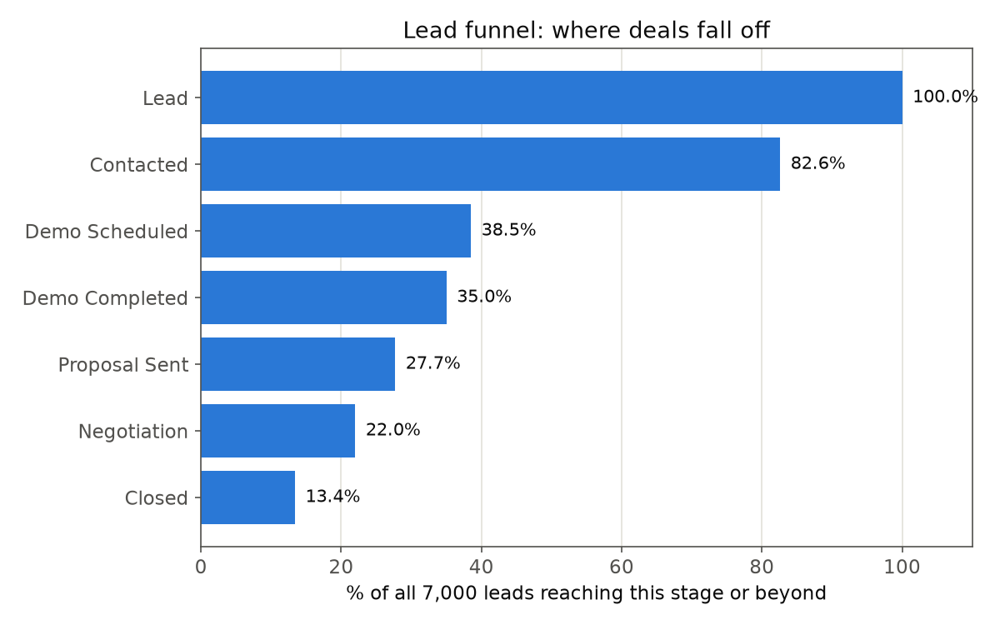
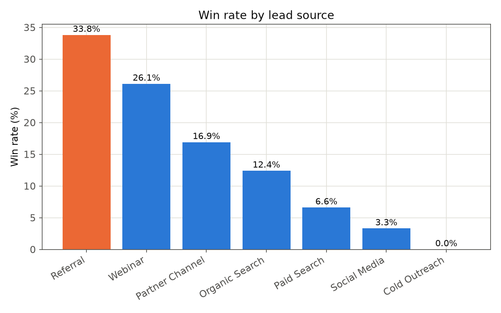
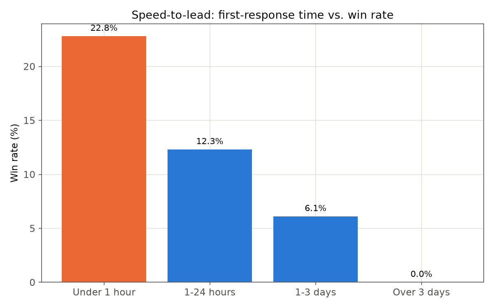
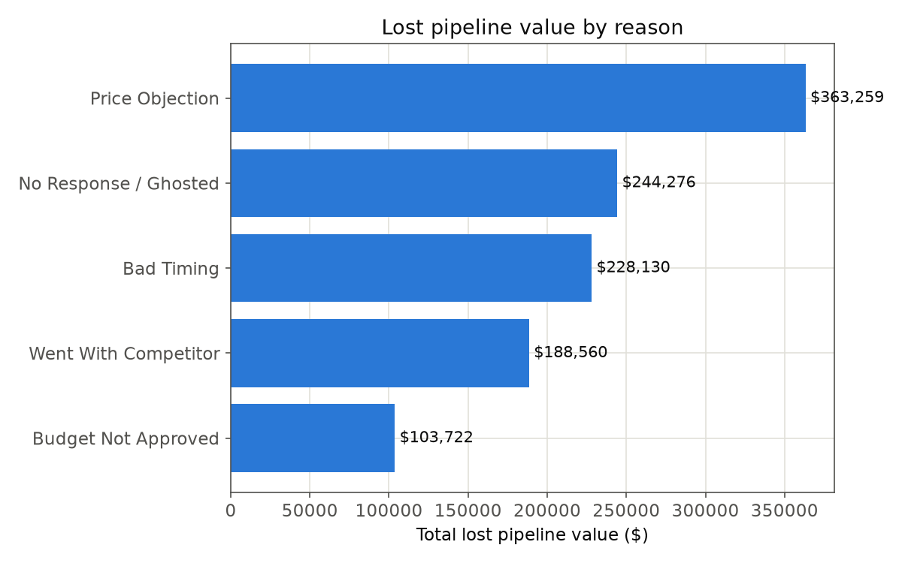
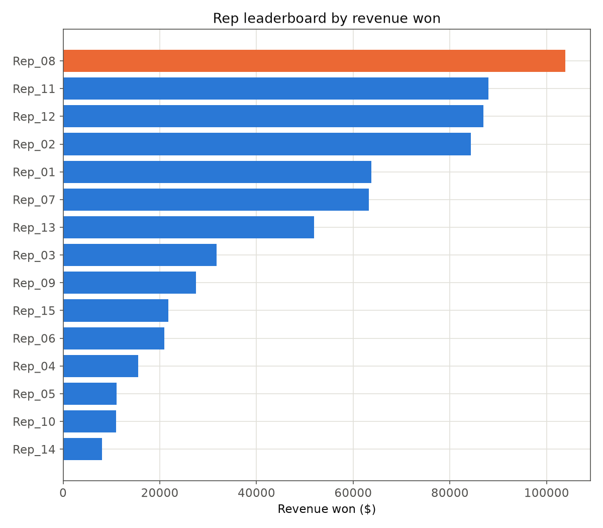
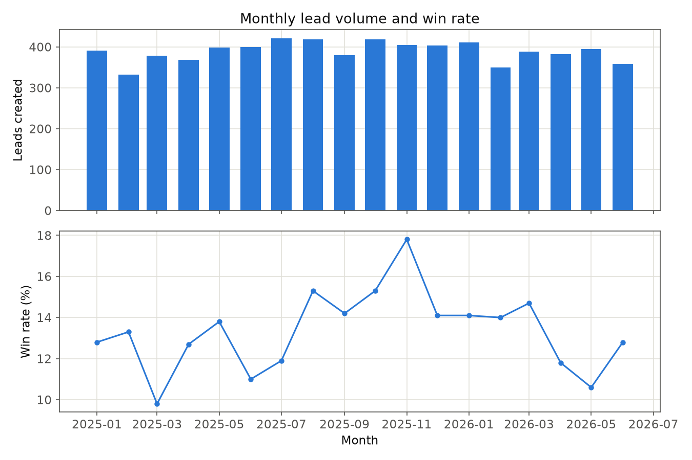

# Sales / Lead Funnel Analytics

A data analyst portfolio project examining where an inside-sales lead funnel leaks, which lead sources and reps actually drive revenue, and how much a single operational lever — response speed — is worth.

**Live dashboard: [sales-funnel-analytics.streamlit.app](https://sales-funnel-analytics.streamlit.app)** — filter by source, region, rep, and date range and every KPI and chart updates instantly. No install needed.

## Why this project

Instead of a generic public dataset, this project uses a **fully synthetic lead-funnel dataset** (`data/generate_data.py`, fixed random seed) that mimics 18 months of activity for an inside-sales team, then deliberately reintroduces realistic CRM-export messiness — duplicate rows from a sync double-firing, missing region values, inconsistent source/product casing and abbreviations, three different date formats on `created_at`, currency-formatted strings mixed into a numeric `deal_value` column, and a handful of negative response-time entry errors (`data/messify.py`). That messy export is then cleaned through a documented, auditable pipeline (`notebooks/01_data_cleaning.ipynb`) rather than starting from a pre-cleaned CSV.

**No real company, prospect, or customer data is used anywhere in this project.**

## Business question

*Which lead sources and reps are actually driving revenue, and where — and why — is the funnel leaking the most value?*

## Key findings

Across 7,000 leads:

- **The funnel's biggest drop-off is Contacted → Demo Scheduled.** 82.6% of leads get contacted, but only 38.5% ever get a demo scheduled — a loss of 3,090 leads, 53.4% of everyone who was successfully contacted. Every stage after that converts far more gently by comparison (38.5% → 35.0% → 27.7% → 22.0% → 13.4% closed).
- **Response speed has a strong, near-linear effect on win rate.** Leads contacted within 1 hour win at 22.8%, dropping to 12.3% for same-day (1-24 hour) contact and 6.1% for 1-3 day response times. This is the cheapest lever in the entire dataset to pull — it costs nothing but attention to first-response time, yet roughly triples the win rate.
- **Referral (33.8%) and Webinar (26.1%) leads convert far better than Cold Outreach, which converts at exactly 0%** across 724 leads — over a tenth of total volume. That source is large enough, and consistently unproductive enough, to be a genuine budget-reallocation case rather than noise.
- **Late-stage losses (leads that reached Demo Completed or further before falling through) total roughly $1.13M in lost pipeline value**, led by Price Objection ($363K) and No Response/Ghosted ($244K) — these are the deals worth the most focused save-play attention, since they represent fully-qualified pipeline, not top-of-funnel noise.
- **Rep performance varies more than 8x by win rate** — the top rep closes at 29.2% against the team's 13.4% average, while the bottom rep sits at 3.6%, despite the middle-of-pack reps handling comparable lead volume. Worth investigating whether this is a coaching gap or a lead-routing/territory issue.

Full breakdowns (funnel by stage, win rate by source/response-time/rep, lost pipeline value by reason, monthly trend) are in [`sql/02_kpi_queries.sql`](sql/02_kpi_queries.sql), [`notebooks/02_analysis_and_charts.ipynb`](notebooks/02_analysis_and_charts.ipynb), the [live Streamlit dashboard](https://sales-funnel-analytics.streamlit.app), and the Power BI report.

## Recommendations

1. **Investigate the Contacted → Demo Scheduled drop-off first** — it's the largest leak in the funnel by a wide margin, and worth determining whether it's a messaging problem, an objection-handling gap, or reps not following up enough times before giving up.
2. **Set and monitor a sub-1-hour first-response target.** The data shows this alone roughly doubles-to-triples win rate depending on the comparison bucket, at effectively zero additional cost.
3. **Reduce or eliminate spend on Cold Outreach** and shift that rep time toward Referral and Webinar programs, given the source converts at 0% despite meaningful volume.
4. **Build a targeted late-stage "save play"** for deals that reach Demo Completed or beyond, focused on Price Objection and No Response/Ghosted specifically, since that's where the highest-value, most-qualified pipeline is currently being lost.
5. **Look into the rep performance spread** — an 8x gap between top and bottom performers on comparable lead volume is large enough to warrant a coaching or lead-routing review.

## Data cleaning

The raw export (`data/leads_raw.csv`) was deliberately generated with realistic CRM-export issues: ~1.5% duplicate rows (a sync job double-firing), ~6% missing region values, inconsistent casing and abbreviations on `source` and `product` (e.g. "SEO" / "organic search" / "Organic Search" all meaning the same thing), `created_at` stored in three different date formats within the same column, `deal_value` stored as a currency-formatted string (`"$480.00"`) for roughly 30% of rows instead of a plain number, and a small number of negative `response_time_hours` data-entry errors. Each issue is deliberately injected in [`data/messify.py`](data/messify.py) and resolved with a documented, auditable pipeline in [`notebooks/01_data_cleaning.ipynb`](notebooks/01_data_cleaning.ipynb), producing `data/leads_cleaned.csv` — the single source of truth used by every downstream tool in this project (SQL, pandas, Streamlit, Excel, Power BI).

## Tech stack & repo structure

```
Project2-Rebuild/
├── data/
│   ├── generate_data.py            # synthetic funnel data generator (fixed seed)
│   ├── messify.py                  # introduces realistic CRM-export data-quality issues
│   ├── leads_clean.csv             # synthetic ground truth, before messify
│   ├── leads_raw.csv               # messy CRM-style export (generate_data.py -> messify.py)
│   └── leads_cleaned.csv           # cleaned output of 01_data_cleaning.ipynb - used everywhere downstream
├── sql/
│   ├── 01_schema_and_load.sql      # MySQL schema + LOAD DATA INFILE from leads_cleaned.csv
│   └── 02_kpi_queries.sql          # funnel, win rate by source/response-time, lost value, rep leaderboard
├── notebooks/
│   ├── 01_data_cleaning.ipynb      # documented, auditable cleaning pipeline
│   └── 02_analysis_and_charts.ipynb # pandas analysis + chart generation (assets/*.png)
├── app/
│   └── dashboard.py                # interactive Streamlit dashboard (funnel, filters, KPI cards, rep leaderboard)
├── excel/
│   └── Sales_Funnel_Analytics.xlsx # formula-driven workbook (no hardcoded output values)
├── powerbi/
│   └── Sales_Funnel_Analytics.pbix # 3-page Power BI report (Executive Overview, Speed-to-Lead, Rep & Product Performance)
├── screenshots/
│   └── Sales_Funnel_Analytics.pdf  # exported Power BI report pages
├── assets/                         # charts generated by the analysis notebook, referenced below
└── requirements.txt
```

Tool choice mirrors what actually appears across the large majority of German data analyst job postings: SQL, Python (pandas), Excel, and Power BI.

### How to run

```bash
pip install -r requirements.txt

cd data
python generate_data.py
python messify.py
# then run notebooks/01_data_cleaning.ipynb to produce leads_cleaned.csv

# SQL (MySQL):
mysql -u <user> -p < ../sql/01_schema_and_load.sql
mysql -u <user> -p sales_funnel_analytics < ../sql/02_kpi_queries.sql

# Analysis notebook (charts written to ../assets/):
cd ../notebooks && jupyter notebook 02_analysis_and_charts.ipynb

# Interactive dashboard:
cd .. && streamlit run app/dashboard.py
```

Or skip the local setup entirely and use the **[hosted dashboard](https://sales-funnel-analytics.streamlit.app)** directly.

For the Power BI report, open `powerbi/Sales_Funnel_Analytics.pbix` in Power BI Desktop, or view the exported pages in `screenshots/Sales_Funnel_Analytics.pdf`.

## Charts







